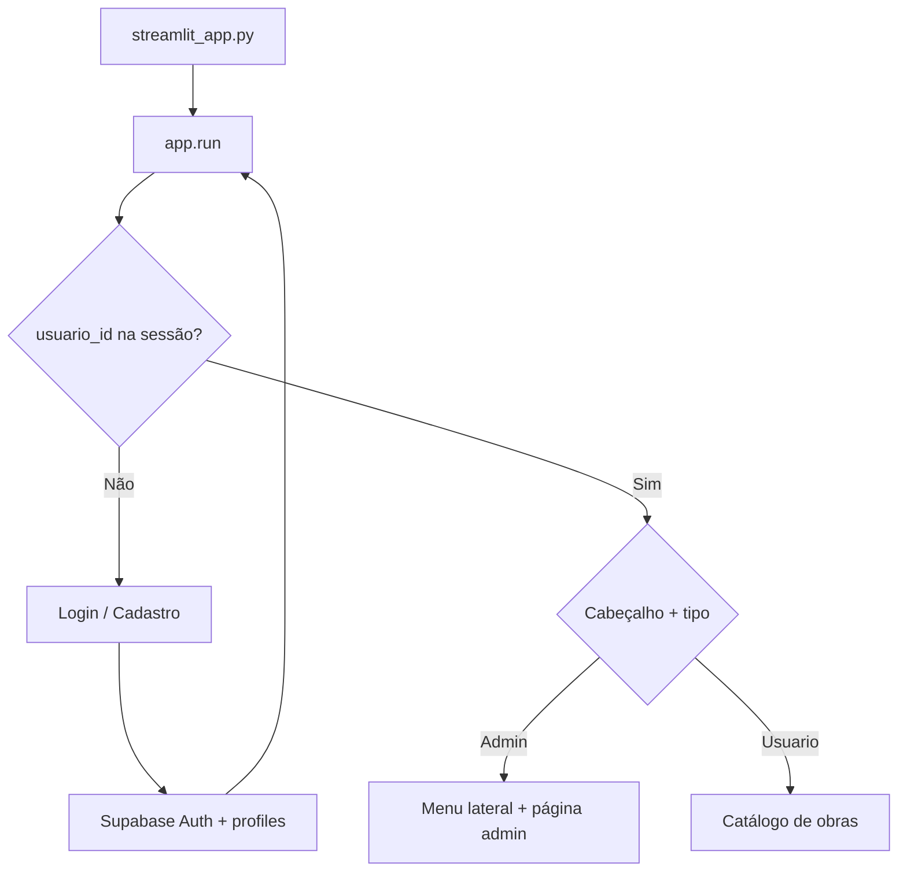

# Critica

Aplicação web em **Streamlit** para autenticação e catálogo de obras audiovisuais, inspirada na experiência do [Letterboxd](https://letterboxd.com/). Usuários exploram obras com capa, nota e descrição; administradores gerenciam o catálogo e permissões pelo painel lateral.

## Stack

| Tecnologia | Uso |
| --- | --- |
| [Python](https://www.python.org/) | Linguagem base |
| [Streamlit](https://streamlit.io/) | Interface web |
| [Supabase Auth](https://supabase.com/docs/guides/auth) | Cadastro e login |
| [Supabase Database](https://supabase.com/docs/guides/database) | Perfis e obras |
| [Supabase Storage](https://supabase.com/docs/guides/storage) | Capas das obras |

## Funcionalidades

### Visitante (não logado)

- Cadastro com nome, e-mail e senha
- Login com e-mail e senha

### Usuário logado

- Boas-vindas com nome e tipo de permissão
- Logout (encerra sessão no Supabase e limpa o `session_state`)

### Usuário padrão (`tipo` = `Usuario`)

- Catálogo de obras com capa, título, nota (0–5), autor e descrição

### Administrador (`tipo` = `Admin`)

Menu lateral com as seções:

| Seção | Descrição |
| --- | --- |
| **Adicionar obras** | Criar obra com título, descrição, nota e capa (JPG/PNG) |
| **Ver obras** | Listagem em cards de todas as obras |
| **Gerenciar obra** | Editar título, descrição, nota e trocar capa |
| **Excluir obra** | Remover obra do banco e arquivo no Storage |
| **Permissões** | Alterar usuário entre **Administrador** e **Padrão** |

## Estrutura do projeto

```text
Critica/
├── .streamlit/
│   └── secrets.toml          # credenciais locais (não versionar)
├── services/
│   ├── obras.py              # CRUD e upload de capas
│   └── perfis.py             # listagem e permissões
├── ui/
│   ├── auth.py               # login, cadastro e logout
│   ├── catalogo.py           # catálogo para usuário padrão
│   ├── components.py         # cards reutilizáveis
│   └── admin/
│       ├── menu.py           # menu lateral
│       ├── adicionar.py
│       ├── ver.py
│       ├── gerenciar.py
│       ├── excluir.py
│       └── permissoes.py
├── app.py                    # roteamento principal
├── config.py                 # constantes e chaves de sessão
├── supabase_client.py        # cliente Supabase
├── streamlit_app.py          # ponto de entrada
├── requirements.txt
└── README.md
```

## Pré-requisitos

- Python 3.10+
- Conta no [Supabase](https://supabase.com/) com projeto criado
- Tabelas `profiles` e `obras`, bucket `obras` e Auth habilitado (ver [Configuração no Supabase](#configuração-no-supabase))

## Como executar

### 1. Clonar o repositório

```bash
git clone https://github.com/SEU_USUARIO/Critica.git
cd Critica
```

### 2. Ambiente virtual

```bash
python -m venv venv
```

**Windows (PowerShell):**

```powershell
.\venv\Scripts\Activate.ps1
```

**Linux / macOS:**

```bash
source venv/bin/activate
```

### 3. Instalar dependências

```bash
pip install -r requirements.txt
```

### 4. Configurar secrets

Crie o arquivo `.streamlit/secrets.toml`:

```toml
SUPABASE_URL = "https://seu-projeto.supabase.co"
SUPABASE_ANON_KEY = "sua-chave-anon"
```

> **Importante:** não commite credenciais reais. O arquivo já está no `.gitignore`. Em deploy (Streamlit Cloud, etc.), use os secrets da plataforma.

### 5. Subir o app

```bash
streamlit run streamlit_app.py
```

O navegador abrirá em `http://localhost:8501` (porta padrão do Streamlit).

### Primeiro administrador

Após o primeiro cadastro, defina manualmente no Supabase (Table Editor → `profiles`) o campo `tipo` como `Admin` para o seu usuário. Depois disso, o menu de administração ficará disponível no app.

## Configuração no Supabase

### Tabela `profiles`

Vinculada ao usuário autenticado (`auth.users`).

| Campo | Tipo | Descrição |
| --- | --- | --- |
| `id` | `uuid` | Mesmo ID de `auth.users` |
| `nome` | `text` | Nome exibido no app |
| `tipo` | `text` | `Admin` ou `Usuario` |

```sql
create table public.profiles (
  id uuid primary key references auth.users(id) on delete cascade,
  nome text not null,
  tipo text not null default 'Usuario',
  created_at timestamptz default now()
);

create or replace function public.handle_new_user()
returns trigger
language plpgsql
security definer
as $$
begin
  insert into public.profiles (id, nome, tipo)
  values (
    new.id,
    coalesce(new.raw_user_meta_data->>'nome', 'Usuario'),
    'Usuario'
  );
  return new;
end;
$$;

create trigger on_auth_user_created
  after insert on auth.users
  for each row execute procedure public.handle_new_user();
```

### Tabela `obras`

| Campo | Tipo | Descrição |
| --- | --- | --- |
| `id` | `uuid` | Chave primária |
| `titulo` | `text` | Título da obra |
| `descricao` | `text` | Sinopse ou descrição |
| `nota` | `numeric` | Nota de 0 a 5 |
| `imagem_url` | `text` | URL pública da capa |
| `usuario_id` | `uuid` | Quem publicou |
| `nome_usuario` | `text` | Nome do autor |

```sql
create table public.obras (
  id uuid primary key default gen_random_uuid(),
  titulo text not null,
  descricao text,
  nota numeric not null check (nota >= 0 and nota <= 5),
  imagem_url text,
  usuario_id uuid references auth.users(id),
  nome_usuario text,
  created_at timestamptz default now()
);
```

### Storage

1. Crie um bucket público chamado **`obras`**
2. As capas são salvas em `capas/<nome-do-arquivo>`
3. Configure políticas de leitura/escrita para usuários autenticados (e RLS nas tabelas, se for usar em produção)

Ao excluir ou substituir uma obra, o app remove o arquivo antigo em `capas/` quando a URL segue o padrão `.../object/public/obras/capas/...`.

## Fluxo da aplicação



1. `streamlit_app.py` chama `app.run()`
2. Secrets carregam `SUPABASE_URL` e `SUPABASE_ANON_KEY`
3. Sem sessão → tela de login ou cadastro
4. Com sessão → consulta `profiles` e roteia por `tipo_usuario`
5. Admin navega por `pagina_admin` (`adicionar`, `ver`, `gerenciar`, `excluir`, `permissoes`)

## Variáveis de sessão

| Chave | Finalidade |
| --- | --- |
| `usuario_id` | ID do usuário autenticado |
| `usuario_email` | E-mail |
| `usuario_nome` | Nome em `profiles` |
| `tipo_usuario` | `Admin` ou `Usuario` |
| `pagina_admin` | Página ativa do painel admin |

## Deploy (Streamlit Cloud)

1. Faça push do repositório para o GitHub (sem `secrets.toml`)
2. Em [share.streamlit.io](https://share.streamlit.io/), conecte o repositório
3. Defina o arquivo principal: `streamlit_app.py`
4. Em **Settings → Secrets**, adicione:

```toml
SUPABASE_URL = "..."
SUPABASE_ANON_KEY = "..."
```

## Segurança e produção

Este projeto é adequado para estudo e protótipos. Para uso em produção, recomenda-se:

- Habilitar **Row Level Security (RLS)** em `profiles` e `obras`
- Políticas no Storage restritas a usuários autenticados
- Revisar quem pode alterar `tipo` em `profiles` (hoje depende das políticas do Supabase)
- Confirmar e-mail no Auth, se necessário

## Roadmap

- [ ] Avaliações e comentários por usuário (estilo Letterboxd)
- [ ] RLS e políticas documentadas no repositório
- [ ] Testes automatizados
- [ ] Temas e layout customizado

## Licença

Projeto em desenvolvimento. Defina a licença desejada (MIT, Apache 2.0, etc.) antes de publicar como open source.
